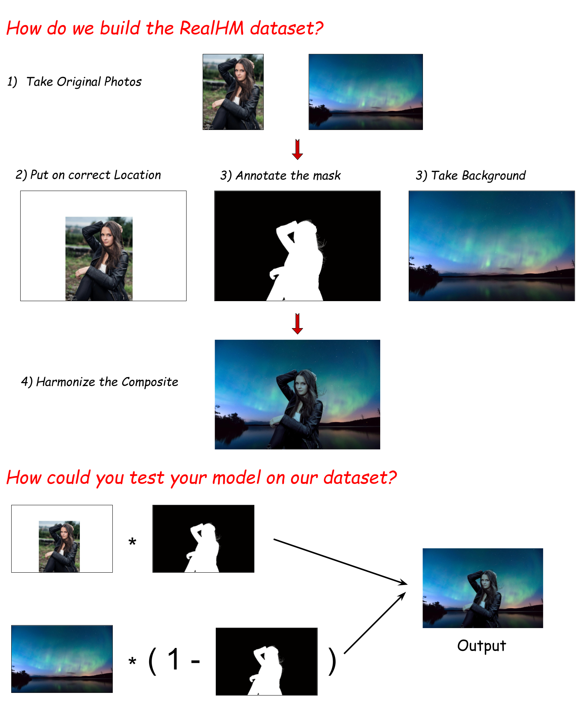
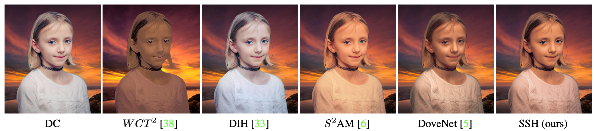
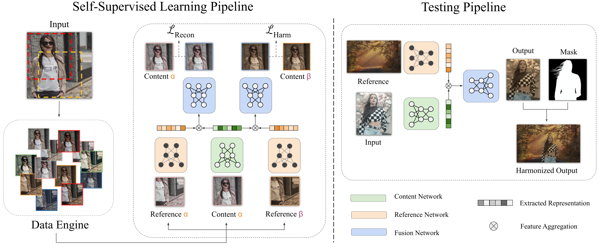

# SSH: A Self-Supervised Framework for Image Harmonization (ICCV 2021)
We provide the inference code and collected Dataset for [Self-supervised Image Harmonization](https://arxiv.org/abs/2108.06805)


## Representative Examples

## Main Pipeline

## RealHM DataSet
[Google Drive](https://drive.google.com/file/d/1lko-0Lp_IMFgSEz4DN5ix9lllY79pmT-/view?usp=sharing)

## Pretrained Weight
[Google Drive](https://drive.google.com/file/d/1DPK6w0RK6HerpAdEG3NlyRo6rqaXwidX/view?usp=sharing)

## Citation
```
@article{jiang2021ssh,
  title={SSH: A Self-Supervised Framework for Image Harmonization},
  author={Jiang, Yifan and Zhang, He and Zhang, Jianming and Wang, Yilin and Lin, Zhe and Sunkavalli, Kalyan and Chen, Simon and Amirghodsi, Sohrab and Kong, Sarah and Wang, Zhangyang},
  journal={arXiv preprint arXiv:2108.06805},
  year={2021}
}
```
