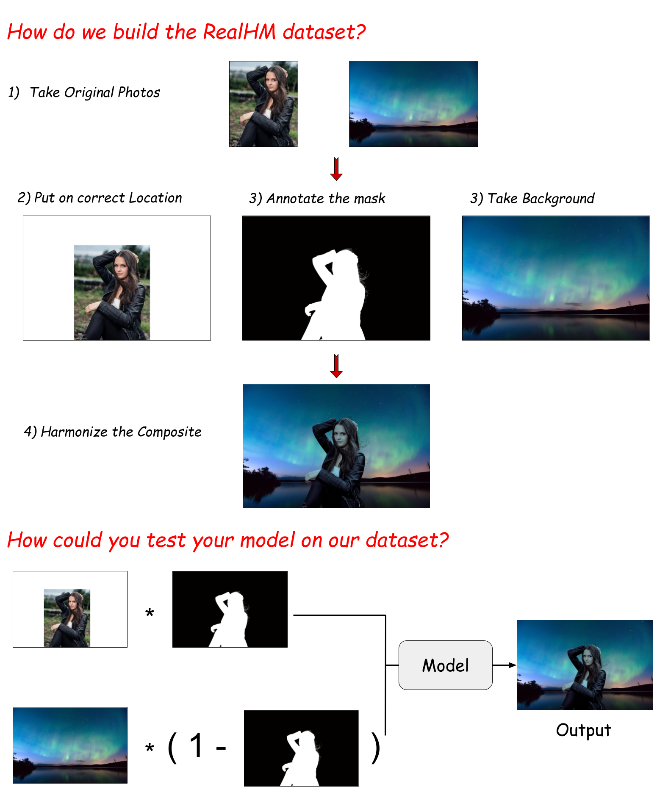

# SSH: A Self-Supervised Framework for Image Harmonization (ICCV 2021)
We provide the inference code and collected Dataset for [Self-supervised Image Harmonization](https://arxiv.org/abs/2108.06805)

## Guideline
Download the [RealHM dataset](https://drive.google.com/file/d/1jBx-DBtRX8GaqMvMv-CZutK4jn9tz-fT/view?usp=sharing) and put it on `../RealH`'. 
Ddownload the [pretrained weight](https://drive.google.com/file/d/19OtBUedEM3QnsUEn0ECxFCmlU0mzDRcT/view?usp=share_link) and put it on `./`.  
Create directory `output`. 
Then Run the `demo.ipynb`.
```
pip install -r requirements.txt
```
## updates
add environment file (Feb. 2022)
Bugs are fixed in the newest version (Jan. 2022)

## Representative Examples

## Main Pipeline


## Dataset Pipeline
<div>
	
</div>

## Citation
```
@inproceedings{jiang2021ssh,
  title={Ssh: A self-supervised framework for image harmonization},
  author={Jiang, Yifan and Zhang, He and Zhang, Jianming and Wang, Yilin and Lin, Zhe and Sunkavalli, Kalyan and Chen, Simon and Amirghodsi, Sohrab and Kong, Sarah and Wang, Zhangyang},
  booktitle={Proceedings of the IEEE/CVF International Conference on Computer Vision},
  pages={4832--4841},
  year={2021}
}
```
